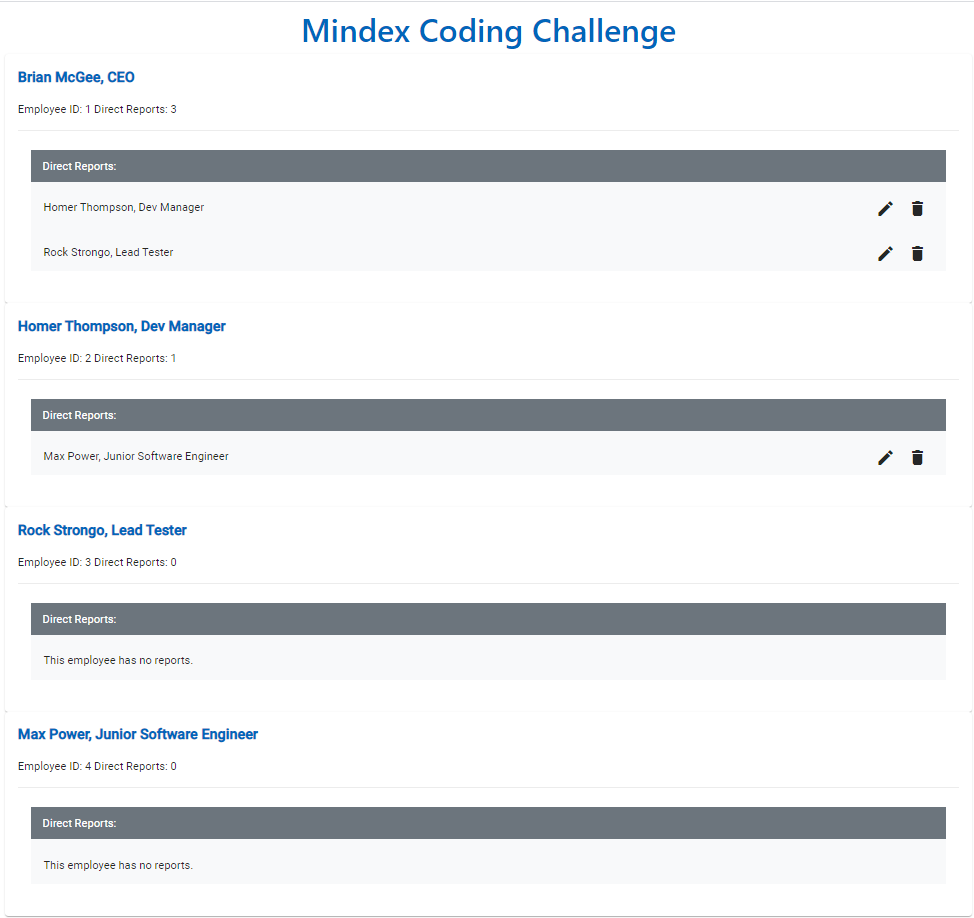
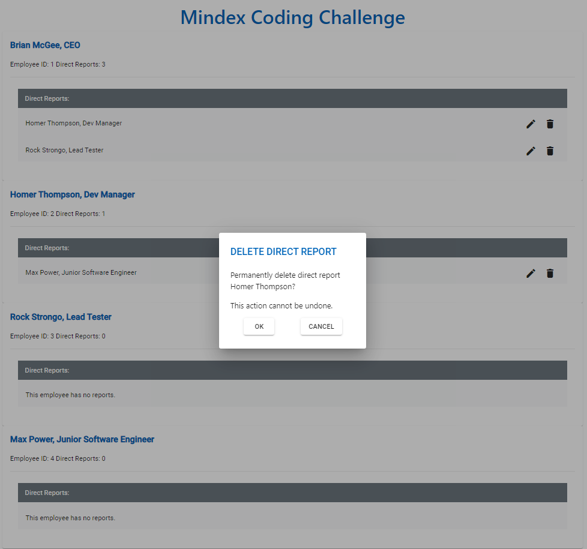
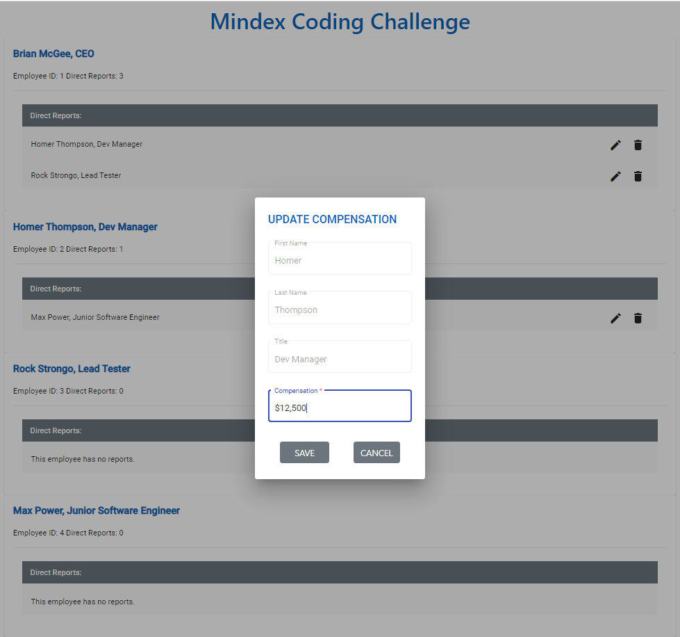

# Mindex Angular 9 Coding Challenge

**NOTE** The bundler fails to build on newer versions of node (for just the started code). I had node 20 and the initial code for the challenge would not build until I reverted back to 16. (v16.20.2)

## My thoughts & notes on the implementation
I tried to stick to the guidelines presented in the tasks below (how I understood what was being asked below). There are a few things I noted while completing this challenge, where I might have implemented things differently than how it seemed the the instructions wanted me to implement them. I have noted them below for reference.

1. I made a comment in the dialog component, about how I may have split them up into 2 different components rather than using one component to handle both edit & delete. None of the logic for formatting the compensation would be required for deletion, and having to change the title based on the action makes using component more complicated than perhaps it needs to be in my opinion. However I understood the ask to be to create **one** new component for this task. (S in SOLID)
2. I am assuming that direct & indirect reports means all the children below the employee in the "tree" regardless of depth. The task indicates to do this in the employee component, which means a complete list of all employees is required within the employee component to derive this information. I added an additional input to the component to pass the list of employees rather than re-fetching the data via the service. Ideally, this should probably be calculated outside this component to make the component "single-purposed" and not depend on extra info / state / data to achieve it's purpose than what it needs. But the task says to do this ("add a new field that collects the employees reporting to this person, directly and indirectly") in the employee component, so that is how I implemented it.
3. The mock backend doesn't remove referenced employee ids for employees that are deleted. I could update the other employees first, to remove the id from `directReports` before deleting, but I had to stop somewhere so I did not (seems like that was outside the scope of this challenge).

## Things I added
* I added `prettier` as a dev dependency as a formatter. Has no effect on the code during runtime, but I added it so I figured I should mention it.

# Original Document
## What's Provided

An [Angular 9](https://angular.io/) employee web application has been created and bootstrapped using an in browser "database".
Basic unit and e2e tests have been created. [Angular Material Design](https://material.angular.io/) and [Flex Layout](https://github.com/angular/flex-layout)
have been added as dependencies. Feel free to add or use other dependencies as you see fit.

## Expectations

- Spend a few hours alone on this. There is no required temporal component to the challenge. You are done when you say you are. We want to see your best efforts. If you need guidance here, 3 to 4 hours is likely sufficient, more experienced candidates may not need that much time. This is your chance to show us what you got.
- Your solution should **not** be collaborative & should be your own work.
- Use of Google or other on-line resources to get you over a technical hump is acceptable.
- **Understand the code you write, you may be asked to explain it.**
- A complete solution should be the goal, but an **incomplete solution is acceptable**. Code what you know how to code well.
- It is highly recommended that you write unit tests and/or e2e tests to thoroughly verify existing and any **added** functionality.
- The challenge can be sufficiently completed without the use of the **Angular RxJS Library**, but it is recommended.
- If you are a Sr. level Candidate, the correct use of the **Angular RxJS Library** library is **REQUIRED** & it is expected that it's use, where appropriate is part & parcel of your solution. If this requirement is unclear to you, please ask your Mindex Talent Acquisition Adviser for clarification.
- Ask questions if something isn't clear. The Talent Acquisition Adviser you are working with knows how to reach a Sr. Mindex developer to resolve any questions you may have.

### Initial setup

Install [Node](https://nodejs.org/en/) version 10.13+. After installation run `npm install` at the root of this project.

### Development server

Run `npm start` for a dev server. Navigate to `http://localhost:4200/`. The app will automatically reload if you change any of the source files. You may notice build errors when you attempt to build/start the app for the first time. This is by design, the compile-time errors should describe what is missing. Completing Tasks 1 & 2 will resolve this.

### Build

Run `npm run build` to build the project. The build artifacts will be stored in the `dist/` directory. Use the `--prod` flag for a production build.

### Running unit tests

Run `npm test` to execute the unit tests via [Karma](https://karma-runner.github.io).

### Running end-to-end tests

Run `npm run e2e` to execute the end-to-end tests via [Protractor](http://www.protractortest.org/).

### Further help

To get more help on the Angular CLI use `ng help` or go check out the [Angular CLI README](https://github.com/angular/angular-cli/blob/master/README.md).

## What to Implement

The tasks for this challenge will build a simple user interface that will allow a user to view a listing of employees and their direct reports. Thew challenge will ask you to build and layout the page as shown and to implement a couple CRUD operations on the listing of direct reports, specifically to UPDATE the compensation and DELETE the direct report. As a final task, the challenge with ask you to add styling to the page components.

### Task 1

1. Browse the code base and familiarize yourself with the file structure. If you've used the Angular-CLI in the past, the directory structure should be familiar.
2. Add a new compensation property of type number to the [employee](./src/app/employee.ts) type.

### Task 2

1. Add the type to the [employee component](./src/app/employee/employee.component.ts). The [employee](./src/app/employee.ts) type may have the property directReports which is an array of other employee ids who report directly to this employee.
2. On the [employee component](./src/app/employee/employee.component.ts) add a new field that collects the employees reporting to this person, directly and indirectly & display the **total** number of these employees in the header of the card.

### Task 3

1. On the [employee view template](./src/app/employee/employee.component.html) add functionality to list the direct reports, if any, and & style the rows to disambiguate the reports.
2. On each report row, create two buttons. One for **EDITING** a row item and one for **DELETING** a row item.
3. Implement an **EventEmmiter** on the **Employee Component** that will emit an event to the parent **Employee List Component** to handle the CRUD action. The **Employee List component** should handle initiating and observing the service request (EDIT/DELETE).

### Task 4

1. Create and register a new app-level component to show a dialog to the user. This dialog will be used to either show a Delete confirmation, or to present the user with a form by which they can update the employee compensation:

### Task 5

1. Implement in the **Employee List Component** the handler to initiate and observe the service calls to either delete or update the direct reports being serviced in the previous task.

### Task 6

1. Style the page to your liking, ... show us what you got. Have fun.
